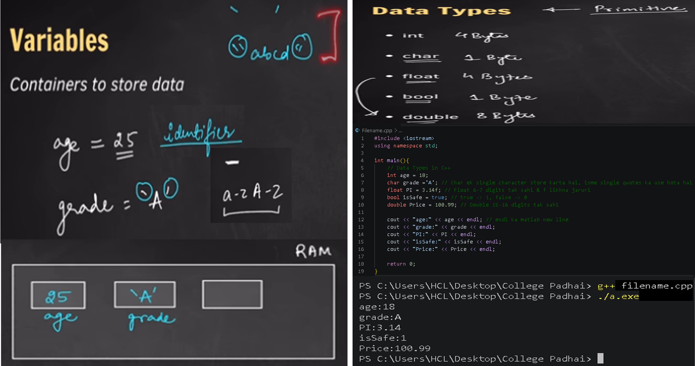
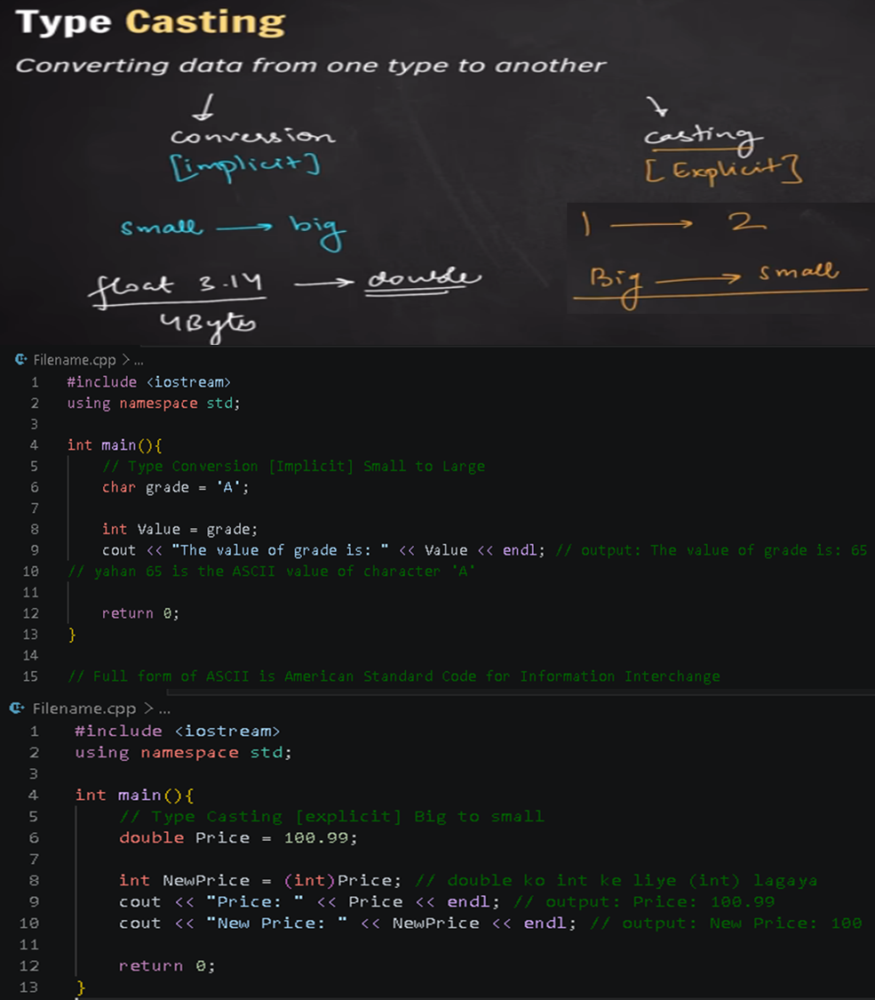
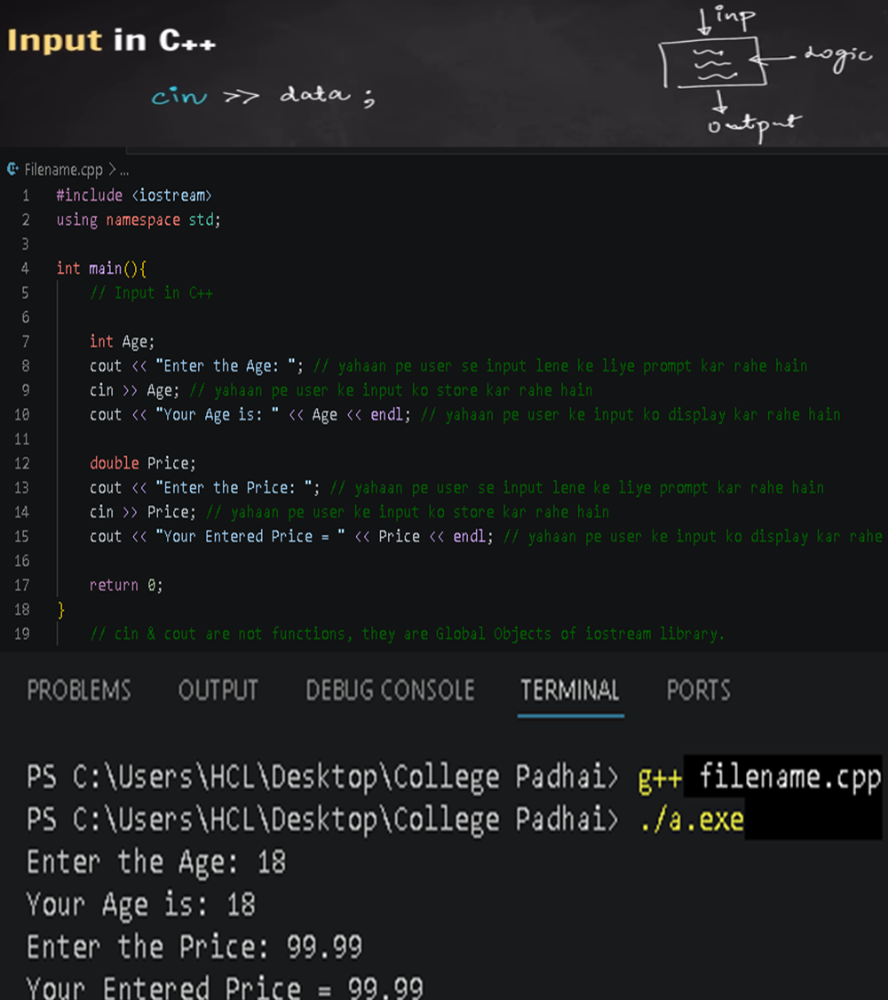
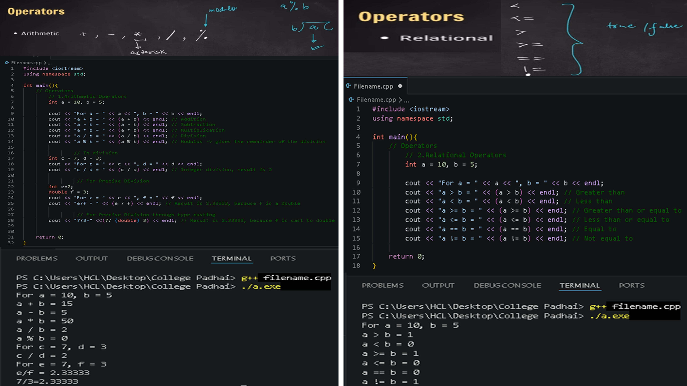
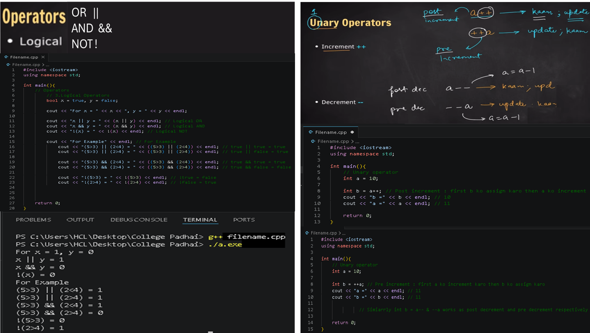
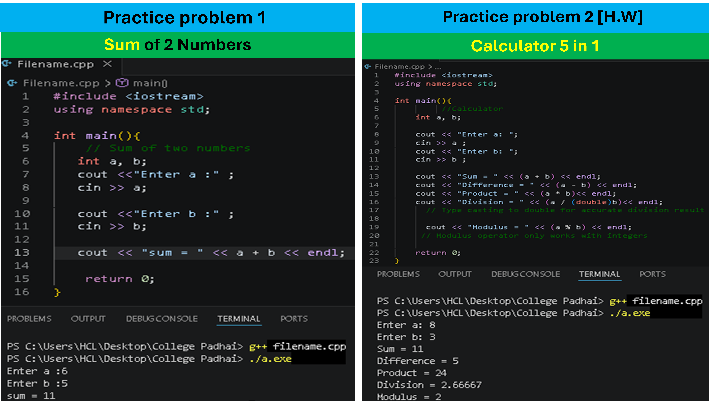

# L-02: Variables, Data Types & Operators

## ⚡ Quick Revision Notes

| Concept | Key Point | Code Example |
| --- | --- | --- |
| **Variables** | Data store karne ke containers | `int age = 25;` |
| **Data Types** | `int`, `float`, `double`, `char`, `bool` | `char grade = 'A';` |
| **sizeof()** | Bytes me size batata hai | `sizeof(int)` → 4 |
| **Implicit Conversion** | Chote → Bade type, automatically | `int` → `double` |
| **Explicit Casting** | Bade → Chote type, manually | `(int)100.99` → 100 |
| **cin** | User se input lene ke liye | `cin >> age;` |
| **Arithmetic** | `+`, `-`, `*`, `/`, `%` | `5 / 2` → 2 |
| **Relational** | `>`, `<`, `>=`, `<=`, `==`, `!=` | `a > b` → 1 or 0 |
| **Logical** | `||`, `&&`, `!` | `true && false` → 0 |
| **Post ++** | Pehle use karo, baad me badhao | `int b = a++;` |
| **Pre ++** | Pehle badhao, baad me use karo | `int b = ++a;` |
| **Typecast in Division** | Correct answer ke liye | `a / (double)b` |

## 📁 All Code Files

1. **[Data Types & sizeof()](./codes/L02_01_datatypes.cpp)** - `int`, `char`, `bool`, `float`, `double` ke examples
2. **[Implicit Type Conversion](./codes/L02_02_type_conversion_implicit.cpp)** - `char` → `int`, `int` → `double` auto convert
3. **[Explicit Type Casting](./codes/L02_03_type_casting_explicit.cpp)** - `double` → `int` manually convert
4. **[User Input](./codes/L02_04_input.cpp)** - `cin` se input lena
5. **[Arithmetic Operators](./codes/L02_05_operators_arithmetic.cpp)** - `+`, `-`, `*`, `/`, `%` sab ek saath
6. **[Relational Operators](./codes/L02_06_operators_relational.cpp)** - `>`, `<`, `==`, `!=` ka output 1/0 me
7. **[Logical Operators](./codes/L02_07_operators_logical.cpp)** - `||`, `&&`, `!` ke examples
8. **[Post Increment](./codes/L02_08_operators_unary_post.cpp)** - `a++` pehle assign, baad me increase
9. **[Pre Increment](./codes/L02_09_operators_unary_pre.cpp)** - `++a` pehle increase, baad me assign
10. **[Sum of 2 Numbers](./codes/L02_10_sum_of_two_numbers.cpp)** - Practice Problem 1
11. **[Calculator 5 in 1](./codes/L02_11_calculator_5_in_1.cpp)** - Practice Problem 2: +, -, *, /, %

## 🖼️ Notes Images - Fast Revision

### 1. Variables & Data Types

### 2. Type Casting & Conversion

### 3. Input using cin

### 4. Arithmetic & Relational Operators

### 5. Logical & Unary Operators

### 6. Practice Problems

## ⚙️ How to Run
Code file se code copy karo, VS Code me paste karke Run karo.

---
**Next:** [L-03: Conditional Statements & Loops](../L-03_Conditional_Statements_Loops)
